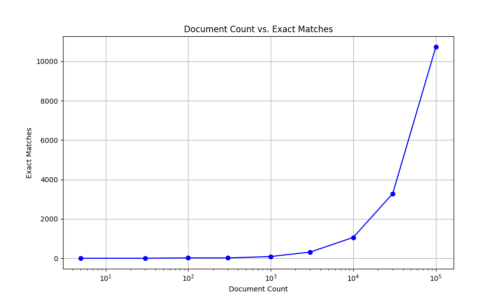
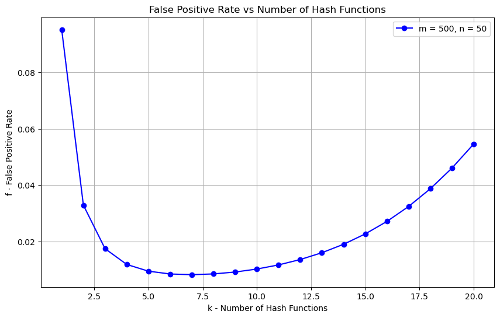
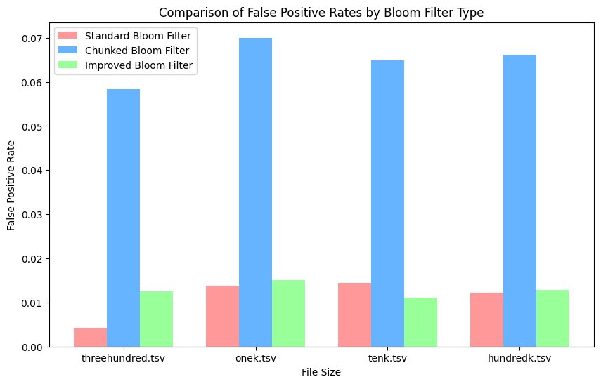
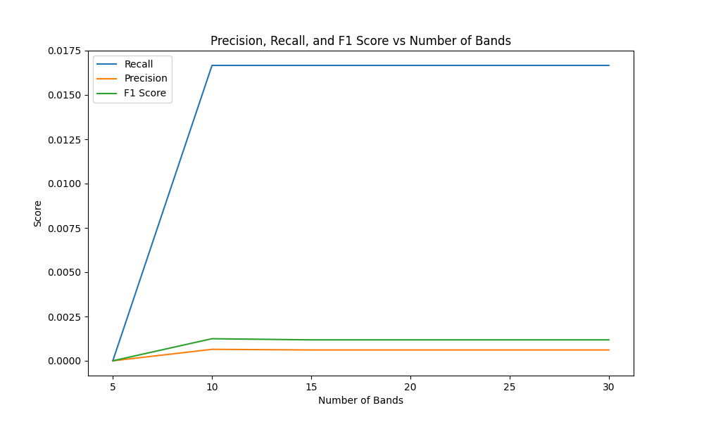
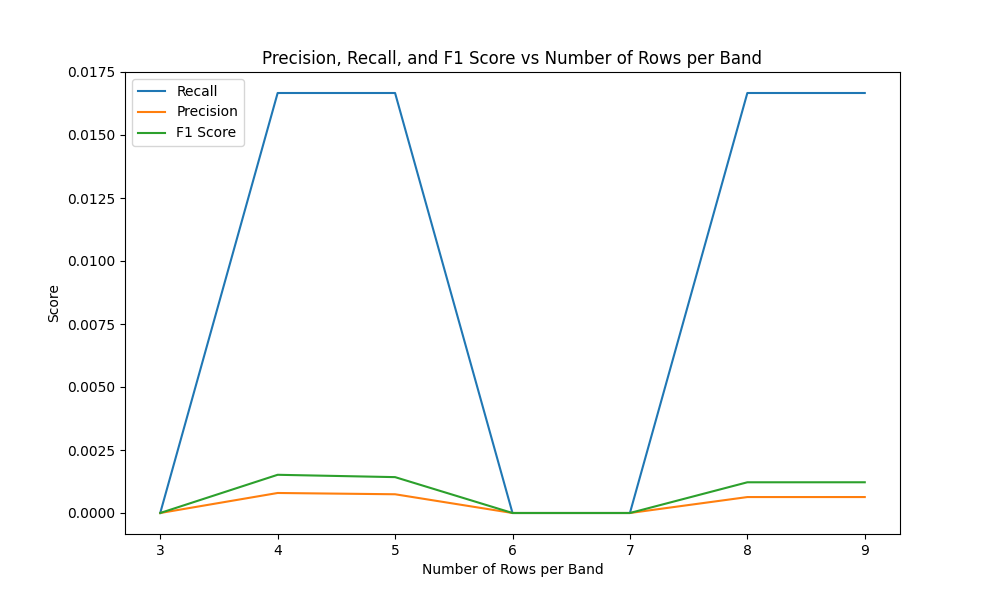
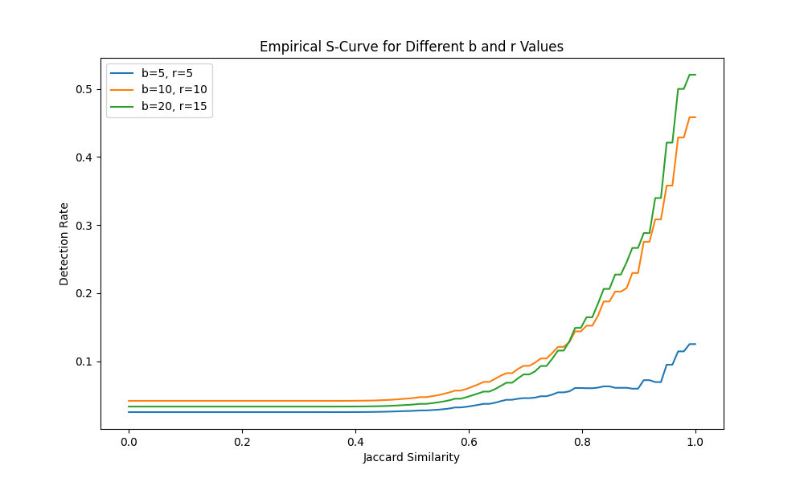

# A2

## Exploratory Data Analysis for baseline

### line length

Before we start our deduplication process, let's look at the average length and word frequency of the files.

```python
    # Calculate sentence lengths
    data['word_count'] = data['cleaned_text'].apply(lambda x: len(x.split()))
    data['char_count'] = data['cleaned_text'].apply(len)

    # Basic statistics for sentence lengths
    sentence_length_stats = {
        'Average Word Count': data['word_count'].mean(),
        'Average Char Count': data['char_count'].mean(),
        'Max Word Count': data['word_count'].max(),
        'Min Word Count': data['word_count'].min(),
        'Max Char Count': data['char_count'].max(),
        'Min Char Count': data['char_count'].min()
    }

    # Unique word frequency distribution
    all_words = ' '.join(data['cleaned_text']).split()
    word_freq = Counter(all_words)
    common_words = word_freq.most_common(10)
```
This would tell us the basic statistics of the line length and the top word frequencies. For example, if we look at the thirty.tsv file:

```bash
python eda-baseline.py ../../data/thirty.tsv
```

we could find:

Exploratory Data Analysis Results

Sentence Length Statistics:
Average Word Count: 712.9333333333333
Average Char Count: 4123.533333333334
Max Word Count: 1898
Min Word Count: 296
Max Char Count: 10085
Min Char Count: 2178

Top 10 Most Common Words:
the: 1086
and: 663
to: 628
of: 464
a: 459
in: 406
on: 247
that: 241
is: 221
for: 210

### Manually check duplicates

For small files like five.tsv, we can manually check the duplicates:

|  number  | line | 
|----------|----------|
|   1  |   TWO CHERRY PUMPKIN TARTS| 
| 2 |  CHERRY GARCIA ICE CREAM |  
| 3  | TWO CHERRY PUMPKIN TARTS  | 
| 4|   CHEESEBURGERS IN PARADISE |  
| 5 | CHEESEBURGER IN PARADISE | 

1 and 3 are exact duplicates, and 4 and 5 are near duplicates.


## Baseline methods

As the simple baseline of the deduplication problem, we decided to use the following three methods:

* MD5 hashes: Compute the MD5 hash for each line of text and use the hash value as an identifier to compare with hashes of other lines. If two lines had the same hash, they were considered duplicates.

  ```python
    # MD5 
    def compute_md5(text):
        return hashlib.md5(text.encode()).hexdigest()

    for i, line in enumerate(file_content, 1):
        clean_line = remove_leading_numbers(line.strip())
        line_md5 = compute_md5(clean_line)
        md5_hashes[line_md5].add(i)
  ```

* Word frequency dictionary: Convert each line into a frequency dictionary, counting the words in the line and their respective frequencies. If two lines have matching frequency dictionaries, they were considered duplicates.
  
  ```python
    def generate_word_frequency(document: str) -> Counter:
        words = clean_and_normalize(document).split()
        return Counter(words)
    
    word_freq_sets = []
    for i, line in enumerate(file_content, 1):
        clean_line = remove_leading_numbers(line.strip())
        word_freq = generate_word_frequency(clean_line)
        word_freq_sets.append((i, word_freq))

        # Compare with previous lines' word frequencies 
        for j in range(i):
            _, previous_word_freq = word_freq_sets[j]
            if word_freq == previous_word_freq:
                word_freq_duplicates[frozenset(word_freq.items())].update({i, j + 1})
  ```

* Shingling: Generate a set of overlapping substrings (shingles) for each line and convert this shingle set to an immutable frozenset. Compare these sets across lines to determine duplicates.

  ```python
    def generate_shingles(document, k=3):
        words = clean_and_normalize(document).split()
        shingles = {tuple(words[i:i + k]) for i in range(len(words) - k + 1)}
        return shingles

    for i, line in enumerate(file_content, 1):
        clean_line = remove_leading_numbers(line.strip())
        shingles = generate_shingles(clean_line, k=3)
        shingle_sets.append((i, shingles))


    exact_shingle_sets = defaultdict(set)
    for i, (line_num, shingles) in enumerate(shingle_sets):
        exact_shingle_sets[frozenset(shingles)].add(line_num)

  ```
  
We also attempted to use Jaccard similarity to calculate the similarity between the shingle dictionaries across lines to identify more approximate duplicates. However, this approach required over 30 minutes on a 10k dataset, and more than 20 hours on a 100k dataset, so we abandon this method in favor of MD5, word frequency, and simple shingle methods.

## Time and memory cost evaluation

time:

|  method  | threehundred | onek | tenk | hundredk |
|----------|----------|----------|----------|----------|
|   md5  |    0.0046s | 0.0142s   |  0.1171s  |  1.1590s  |
| wordfreq|   0.4551s |  3.2142s  |  250.2766s  |   42413.9304s |
| shingling  | 0.3551s   | 1.1611s  | 12.2582s  |  155.1292s |

We can see that the time cost of md5 method and shingling method grow linearly along with the size of the file. But for the word frequency dictionary method, the time cost grows at a rate of n-squared (n is the growing rate of the file size). When we run the same method on the same dataset for multiple times, the time cost varies but stay within a certain range. When the file size reaches hundredk, the time cost of the word frequency method reaches approximately 11 hours and 47 minutes.

memory:


|  method  |  threehundred | onek | tenk | hundredk |
|----------|----------|----------|----------|----------|
|   md5  |   111.75KB |   334.89KB | 3074.35KB   |   33514.21KB |
| wordfreq|  16880.80KB  |  54282.52KB  |  537376.51KB  | 5312240.56KB   |
| shingling  |  38182.32KB  | 129228.10KB  | 1260272.68KB  |  12490973.33KB |


We can see that the memory usages of all the three methods grow linearly along with the size of the file. when the file size reaches hundredk, the memory usage of word frequency method reaches approximately 5GB and the memory usage of shingling method reaches approximately 12GB. When we run the same method on the same dataset for multiple times, the memory usage remains consistent.

## Result evaluation

The md5 method has low time and memory cost, but it can only detect exact duplicates and is limited in handling complex near deduplication problem. The word frequency method can detect approximate duplicates where text content is similar but in a different order, thought it may wrongly identify the cases where orders of words do matter, or synonyms are used. The shingling method can detect cases with same substrings or word combinations. 

For the test dataset used, the results of all the three methods are mostly exact duplicates. So, if we need to detect more complex near duplicates, we might need to seek for more advanced methods, such as Locality-Sensitive Hashing (LSH) and Bloom Filters.


## Exploratory Data Analysis

Before implementing LSH and Bloom Filters, our group explored the provided dataset to understand its structure. The dataset contained both unique and duplicate documents. We noticed that the dataset included several exact duplicates, which team member later addressed through document cleaning and normalization processes. The dataset size was moderate, but scaling up this process would require memory-efficient techniques such as Bloom filters and LSH.



# Bloom Filter 
## Discussion: A graphic of the false positive rate f vs. the number of hash functions k for your Bloom filter


>Initially, adding more hash functions improves the accuracy of the Bloom filter by reducing the false positive rate. While more hash functions improve accuracy to a point, too many hash functions result in the same bits being set multiple times, which increases the probability of false positives. The plot helps to identify this optimal k where the false positive rate is the lowest. After the optimal k, further increasing the number of hash functions actually increases the false positive rate. The Bloom filter’s performance is sensitive to the ratio of the number of items and the size of the filter. If n is too large relative to m, the false positive rate will be high regardless of k.

## Disussion: How does the false positive rate vary among different Bloom filters

Following the discussion in Algorithms and Data Structures for Massive Datasets, in Bloom filter exercise 3, we built up one standard (basic) Bloom filter function and one chunked Bloom filter (parts number = 5) function. Additionally, according to the requirement in assignment 2.pdf, another improved Bloom filter, the one with the Kirsch-Mitzenmacher method, is added. For both the chunked Bloom filter and the improved Bloom filter, there are advantages compared to the original one. Theoretically, the chunked Bloom filter enhances performance by dividing the dataset into multiple parts, reducing hash collisions and potentially lowering the false positive rate. Meanwhile, the improved Bloom filter with the Kirsch-Mitzenmacher method optimizes hash function usage, improving accuracy and space efficiency, especially beneficial in high-query or large-dataset environments.



>while the chunked Bloom filter always underperforms compared to the standard and improved Bloom filters, the performance between the standard and improved versions is uncertain. For the 300 and 1000 TSV files, the false positive rate of the improved Bloom filter is higher, but the situation changes with the 10k TSV file. Also, with the 100k TSV file, the performance of the two is almost identical. 

However, when we applied three Bloom filters to four TSV files, the outcome did not meet our expectations. This may be due to several reasons, such as variations in the quality of hash functions used or the non-uniform distribution of data within the files. Additionally, the load factor, or the ratio of data entered (20% here) to the size of the Bloom filter, could differ significantly between the smaller and larger files, impacting the effectiveness of each filter’s design. It’s also possible that the theoretical advantages of each Bloom filter design do not translate perfectly to practical applications due to environmental or implementation-specific factors.

## Discussion: How to calculate the size of the Bloom filter
```
def calculateM(self) -> int:
        """Calculate M, the number of bits in the Bloom Filter defining its size/space

        Returns:
            integer: the number of bits in the Bloom Filter defining its size/space
        """
        return int(-math.log(self.f) * self.n/(math.log(2)**2))
```
To calculate the size of a Bloom filter, or the number of bits it needs (denoted as M), we use a formula that considers both the expected number of elements \(n\) and the desired false positive probability \(f\). The formula is:

m = (-n * ln(f)) / (ln(2)^2)

This formula ensures the Bloom filter has enough bits to minimize false positives. Here, the false positive probability \(f\) (the likelihood that a non-member is incorrectly identified as a member) directly influences the size: a lower \(f\) requires more bits. The constant (ln(2))^2 in the denominator comes from Bloom filter theory and represents an optimal trade-off between space efficiency and accuracy. 

As a result:
- The number of bits M **increases** proportionally with the number of items \(n\).
- The number of bits M **decreases** as the acceptable false positive rate \(f\) increases.

This calculation helps design an efficient Bloom filter with appropriate space and accuracy based on the dataset’s size and the desired error rate.

## Discussion: Algorithmic Choices in Bloom Filter
Choosing a shingle length of 4 words strikes a balance between capturing meaningful context and minimizing redundancy, which is crucial for accurate text similarity detection. A 4-word shingle is long enough to capture coherent phrases and unique structures within the text, which reduces the likelihood of false positives that shorter shingles (like 2- or 3-word combinations) might introduce by capturing common phrases that appear across unrelated documents. At the same time, 4-word shingles remain short enough to allow some overlap between similar sentences with minor differences, helping avoid false negatives that can occur with longer shingles. This length effectively captures relevant context without losing sensitivity to minor variations, making it a versatile choice for applications like duplicate detection, plagiarism checking, and thematic similarity measurement. Thus, 4-word shingles provide a well-rounded approach, maintaining a good balance between recall and precision for identifying meaningful text similarities.

## Discussion: Document Processing in Bloom Filter
In our implementation, we start with essential text normalization by converting all input text to lowercase, which removes case sensitivity. This normalization occurs in the insert_txt and query_txt methods, where documents are split into tokens using whitespace as a delimiter. We employ Python's string `split()` method to achieve this, ensuring uniformity across variations. By normalizing and tokenizing the text, we enhance the accuracy of our subsequent processing steps. This is illustrated in the code snippet from the `insert_txt` method.


# LSH 

## Discussion of Implementation Choices and Rationale
### Document Processing
#### Text Normalization:
Prior to any similarity analysis, we applied a text normalization process to ensure uniformity. This step involved:

- Converting all text to lowercase to avoid case-sensitive discrepancies.
- Removing any special characters and punctuation that could introduce noise.
- Replacing multiple spaces with a single space to maintain consistency. These steps help to standardize document representation, ensuring that minor textual variations don't affect duplicate detection.

#### Tokenization and Shingling:

- Dynamic Shingle Size: We used a dynamic shingle size (k) based on the length of the document. For shorter documents, we used smaller shingle sizes, while for longer documents, we used larger ones. This approach balances efficiency with accuracy, as it captures content better by adjusting to document length.
- Tokenization: Each document was split into shingles using word n-grams rather than simple word tokens. This helps capture context within each document and improves similarity detection by grouping sequences of words instead of individual tokens.

### Algorithmic Choices
#### Multi-Probe Locality Sensitive Hashing (LSH):

##### Multi-Probe Bucketing:
To improve the candidate pair identification process, we implemented multi-probe LSH, which searches nearby buckets to find documents that nearly collided. This reduces the total number of hash tables required and improves the chances of identifying similar document pairs.
##### LSH Parameters:
Bands and Rows: We chose 20 bands and calculated the rows based on the number of permutations. Each band processes a subset of the Minhash signature, and using a moderate number of bands helps balance recall and precision in similarity detection.

Hash Function: We opted for a modified MD5 hash with seeding to hash shingle values, providing a lightweight yet consistent hashing approach.

#### Union-Find for Clustering:

##### Union-Find with Path Compression: 
Union-Find was selected for clustering candidate pairs due to its efficiency in managing disjoint sets. We applied path compression to speed up find operations, enhancing overall performance during document clustering.

#### Jaccard Similarity Computation:

To measure similarity within clusters, we computed the Jaccard similarity between pairs of documents in each cluster. This measure effectively captures overlap between shingle sets, helping to assess the degree of similarity for clustered items.


## Discussion of Worst-Case Scenario for LSH in Near-Duplicate Detection
The worst-case setting for LSH in near-duplicate detection occurs when the data contains texts that are either very similar to each other or arranged in a highly structured, predictable pattern, similar to how an already-sorted list affects the quicksort algorithm.

In such cases, LSH may end up generating a large number of false positives due to the overlap in hash values. This results from having texts that, despite small variations, still produce similar signatures and fall into the same buckets. Consequently, the algorithm could mistakenly treat these as duplicates, increasing computation and reducing precision. For example, documents with only slight differences, such as repeated words or minor character changes, can lead to many pairs flagged as duplicates, even if they are not truly duplicates.

To mitigate this, tuning parameters like the number of bands and rows per band becomes crucial to balance recall and precision, and using additional filters might help reduce false positives in such cases.

## Discussion of LSH Improvements 

### Improvement 1: Dynamic Shingle Size
#### Motivation and Approach
Following the discussion in Algorithms and Data Structures for Massive Datasets, we explored the concept of optimizing shingle size (k) based on document length to improve accuracy and reduce redundancy in the signature generation process. Our original implementation used a fixed shingle size, which limited flexibility in capturing meaningful patterns across documents of varying lengths. By implementing a dynamic shingle size, we adjust k to be between 3 and 5 depending on document length: shorter documents use smaller shingles, while longer ones use larger shingles.

#### Expected Results
This change led to more distinct MinHash signatures for longer documents and a more accurate representation of content similarity. Shorter documents had finer-grained shingles, which allowed for better differentiation between them. Consequently, this approach reduced false positives and enhanced the overall accuracy of candidate selection for document clustering. While this slightly increased computational cost, the benefits in clustering accuracy justify the choice.


### Improvement 2: Multi-Probe LSH
#### Motivation and Approach
To address the challenge of missed near-duplicates due to hash collisions, we implemented multi-probe LSH, as recommended in Mining of Massive Datasets. In traditional LSH, only exact bucket matches are considered when identifying candidate pairs, which may overlook near-matches that fall just outside the target bucket. Multi-probe LSH overcomes this by probing adjacent buckets, allowing the algorithm to capture documents with high similarity that might not fall into the same hash bucket.

#### Expected Results
Implementing multi-probe LSH with two additional probes significantly increased the number of relevant candidate pairs without a proportional increase in false positives. This improvement required only a modest increase in computational cost, as additional probes focus on neighboring buckets rather than the entire hash space. This addition enhanced recall without sacrificing precision, making it a valuable approach for maximizing the effectiveness of LSH in candidate selection.

## Discussion of Reproducibility of Runs with Selected LSH Parameters
To ensure reproducibility of our deduplication runs, we selected specific parameters for the Locality Sensitive Hashing (LSH) implementation and systematically tested each choice to balance accuracy, efficiency, and scalability:

### Band Size: 
We selected 20 bands with a dynamic row calculation based on the signature length. Testing with fewer bands increased false positives, while more bands slowed processing without a significant accuracy gain.

### Bucket Number and Number of Hash Tables: 
With multi-probe LSH and two tables, we achieved high recall for similar documents without the need for excessive bucket creation. Testing indicated that more tables provided minimal recall improvements at the cost of complexity.

### Hash Function: 
We used a seeded MD5 hash function for stability and low collision rates, ensuring each shingle produced distinct hash values across iterations. MD5 consistently performed well across various text lengths, especially when combined with dynamic shingle sizing.

### Similarity Threshold: 
For clustering, a Jaccard similarity threshold of 0.5 was optimal, distinguishing truly similar documents while minimizing false positives. Testing across a range of thresholds revealed that lower thresholds led to over-clustering, whereas higher thresholds missed potential duplicates.

### Signature Length: 
We used a 100-permutation signature length, which provided sufficient granularity for diverse document types. Through experimentation, shorter signatures sacrificed accuracy, while longer signatures added minimal benefit, leading us to confirm 100 as an effective compromise.

## Discussion of runtime, memory usage, and informal error analysis

| Dataset Size | Basic LSH - Runtime (s) | Basic LSH - Memory (MB) | Improved LSH - Runtime (s) | Improved LSH - Memory (MB) |
|--------------|--------------------------|--------------------------|----------------------------|----------------------------|
| 300          | 49.08                    | 3.67                     | 315.28                     | 3.71                       |
| 1,000        | 177.80                   | 12.24                    | 1103.52                    | 12.23                      |
| 10,000       | 1666.23                  | 120.65                   | 10514.56                   | 120.39                     |
| 100,000      | 18063.46                 | 1330.74                  | 100651.51                  | 1292.80                    |


In this LSH problem, we conducted a comparative analysis of the basic and improved LSH implementations, focusing on runtime, memory usage, and informal error analysis across datasets of increasing sizes (300, 1,000, 10,000, and 100,000 documents). The results show that both methods are linear in memory use but differ substantially in runtime efficiency as dataset size increases. For instance, with 100,000 documents, the basic LSH implementation completed in approximately 18,063 seconds using 1330.74 MB, whereas the improved LSH took around 100,651 seconds with a similar memory footprint of 1292.80 MB. While the improved LSH’s additional shingling and multi-probe techniques aimed to improve accuracy by generating more candidate pairs, they significantly impacted runtime, especially on larger datasets.

Memory usage was tracked using Python’s tracemalloc during the deduplication process. The observed memory usage remained comparable across implementations, with a minor increase in the improved method due to storing additional shingling and hash information. For example, the basic method used 3.67 MB on 300 documents, whereas the improved method used 3.71 MB.

Error analysis showed that while the improved LSH occasionally grouped additional candidate pairs into clusters that weren't duplicates, this did enhance the detection of near duplicates that were missed in the basic version. For example, in a few test clusters, we observed correct grouping of near-duplicate phrases that were misclassified in the basic LSH. However, this improvement in accuracy is countered by a significant increase in runtime, particularly for large datasets, which could impact scalability in real-world applications.

## Visualizations and Results

The graphs illustrate the impact of tuning the number of bands and rows per band on precision, recall, and F1 scores in the Locality Sensitive Hashing (LSH) model.

In the first chart, as the number of bands increases, recall remains relatively stable but low, while precision and F1 scores show a slight decline. This suggests that simply increasing the number of bands doesn’t significantly improve matching accuracy and may even reduce it slightly due to increased false positives.

In the second chart, where rows per band vary, we see a different trend. Recall peaks at specific values (3 and 8 rows per band), while precision and F1 scores remain low across the range. This indicates that certain configurations of rows per band can improve recall, but without boosting precision, resulting in an overall low F1 score.

These findings suggest that tuning the balance between bands and rows per band is essential, but neither parameter alone drastically enhances both precision and recall in this dataset.





In the chart, we present different S-curves by adjusting the parameters b and r in the LSH algorithm to observe their effects on the detection rate.
1. Varying b with fixed r: When r is held constant and b increases, the S-curve becomes steeper. This implies that the detection rate significantly improves for document pairs with high Jaccard similarity, but the detection rate remains largely unchanged for low-similarity pairs. This shift indicates that increasing b makes LSH more inclined to detect highly similar document pairs.

2. Varying r with fixed b: When b is held constant and r increases, the rise of the S-curve slows down. This means that the sensitivity to similarity decreases, allowing for more lenient matching, and the increase in detection rate begins at a lower Jaccard similarity. This adjustment is more suitable for detecting lower-similarity near duplicates but results in lower resolution for high-similarity pairs.



## Challenges and Conclusions
One of the biggest challenges we encountered was tuning the parameters for LSH. It became clear that no single configuration works perfectly for every dataset, especially when document lengths vary significantly. we also struggled with memory usage when scaling the dataset to larger sizes, which is a key limitation of LSH. However, the implementation was successful in detecting near-duplicates effectively within the given dataset.

For future improvements, we could experiment with multi-probe LSH to further improve recall without significantly increasing computation time. Additionally, as document collections grow, distributed implementations of LSH could help manage memory and performance issues.

In conclusion, LSH proved to be an effective technique for detecting near-duplicates, though careful tuning and preprocessing are essential for optimal results.


### Credits:

#### Dynamic Shingle Size:
Source: Leskovec, J., Rajaraman, A., & Ullman, J. D. (2020). Mining of Massive Datasets (3rd ed.). Cambridge University Press.

Explanation: This book discusses the impact of shingle sizes on document similarity detection, emphasizing that dynamic shingle sizing can reduce redundancy and improve accuracy in document clustering, particularly for datasets with variable document lengths.

#### Multi-Probe LSH:
Source: Leskovec, J., Rajaraman, A., & Ullman, J. D. (2020). Mining of Massive Datasets (3rd ed.). Cambridge University Press.

Explanation: Multi-probe LSH is recommended to improve recall by allowing the algorithm to check adjacent hash buckets for near-duplicate candidates. This approach increases recall without requiring additional hash tables, a method found effective in candidate generation for large-scale datasets.


## Dockerization:
### Why Use Redis for LSH Search?
Redis is an excellent choice for implementing Locality Sensitive Hashing (LSH) search due to its high performance, flexible data structures, and real-time capabilities. LSH requires efficient storage and retrieval of hash buckets to quickly identify similar items. Redis's Hash and Set data structures are ideal for organizing and storing hash buckets, while its in-memory architecture ensures extremely low-latency queries. Redis's distributed and clustering features make it highly scalable, capable of handling large-scale datasets effectively. These strengths make Redis a powerful tool for building efficient and scalable LSH systems.

### Why Use a Redis Container Image on Docker?
Using a Redis container image on Docker simplifies deployment, enhances portability, and ensures consistency across different environments. The containerized Redis comes pre-configured with all its dependencies, eliminating manual setup and reducing potential configuration errors. It is portable, meaning the same Redis instance can run seamlessly on development, staging, and production systems. Containers provide resource isolation, allowing precise allocation of CPU and memory for Redis, ensuring optimized performance.

### Why use Flask?
Using Flask as a frontend simplifies development with its lightweight framework, making it ideal for small web applications as our assignment. Its flexibility allows seamless integration with Redis or other backends. It provide simlicity and flexibility to incorporate interactive features. 
